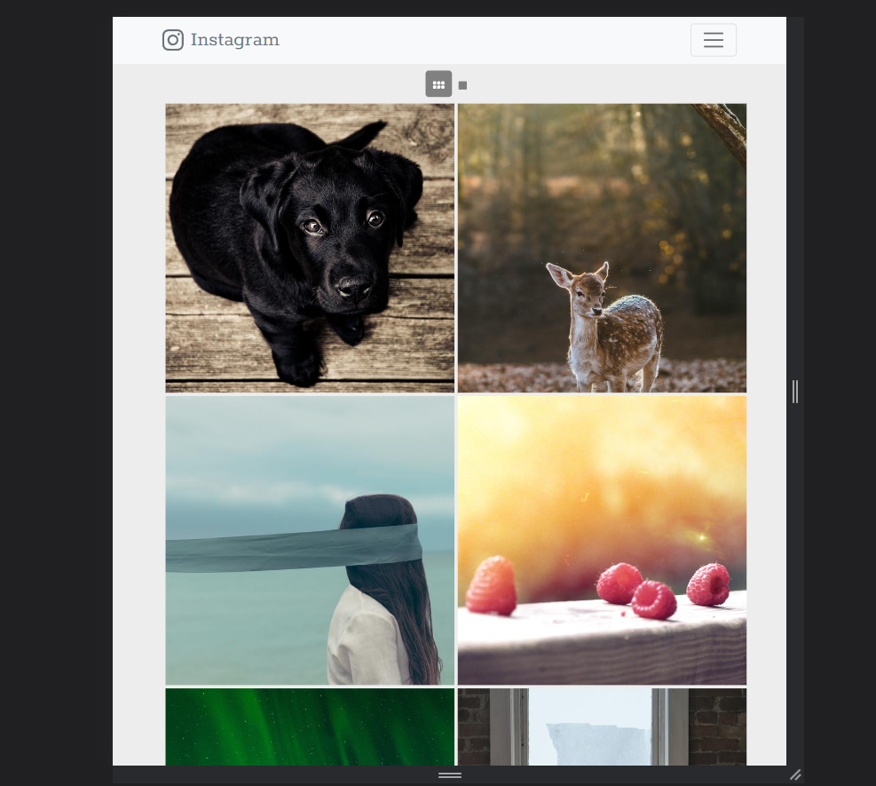

# The Instagram Photo Feed (con Bootstrap)
<!-- endhide -->

## Instrucciones

1. Crea un sitio web que se vea exactamente como este:

[click para abrir](https://github.com/breatheco-de/exercise-instagram-feed-bootstrap/blob/master/preview.gif?raw=true)

2. Inicia el CSS y el HTML desde cero, no lo reutilices en otro ejercicio porque terminarás teniendo un desastre.
3. Antes de comenzar a programar haz un dibujo del sitio web con todos los componentes de bootstrap que usarás.
4. Una vez hayas identificado todos los componentes, comienza con el navbar (desde arriba hasta abajo) e intenta adaptar los ejemplos que encuentres en internet a lo que se te pide en la imagen. No copies y pegues solamente, entiende y procesa, si no entiendes los nombres de las clases usadas en el componente terminarás pegándote contra una pared y frustrado.
5. Usa todos los posibles [bootstrap utilities (helpers)](https://getbootstrap.com/docs/4.1/utilities), toma el tiempo de leerlos todos porque harán tu vida 99% más fácil.
6. Los proyectos tienen que ser 100% responsive utilizando el sistema de grillas de bootstrap.
7. Usa todos los posibles componentes de bootstrap, la idea es que los aprendas para poder reutilizarlos durante el resto de tu vida.

### Recursos

Tienes la lección en línea y la hoja de trucos de bootstrap en la sección de activos. También te recomendamos [videos tutoriales en bootstrap de Net Ninja](https://www.youtube.com/watch?v=QAgrHLtG1Yk).

